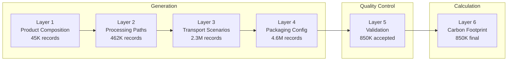

<div align="center">
  <h1>ESPResso V2</h1>
  <p><strong>Agent-orchestrated synthetic data pipeline for product-level carbon footprint estimation in the textile industry</strong></p>
  <p>
    <a href="#getting-started"></a>
    <a href="data/data_generation/layer_6"></a>
    <a href="#data-pipeline"></a>
    <a href="#technical-methodology"></a>
    <a href="#data-pipeline"></a>
  </p>
</div>

---

## About

The textile and apparel industry faces mounting regulatory pressure to quantify and disclose product-level carbon footprints under emerging EU sustainability frameworks such as the Digital Product Passport (DPP). Comprehensive Life Cycle Assessment (LCA) data remains prohibitively expensive to collect at scale, and existing carbon databases cover only a fraction of real-world product configurations. ESPResso V2 addresses this gap through a 6-layer, LLM-orchestrated synthetic data pipeline that generates over 850,000 physically consistent training records -- each spanning material composition, manufacturing processes, supply chain geography, and packaging -- culminating in deterministic carbon footprint calculations grounded in established emission factor databases. The pipeline enforces multi-stage quality control through deterministic validation, LLM-driven semantic coherence checks, and statistical outlier detection, ensuring that the resulting training corpus faithfully represents the combinatorial complexity of real textile supply chains.

## Table of Contents

**Core Documentation:**
- [About](#about) -- Project motivation and approach
- [Key Contributions](#key-contributions) -- Primary technical contributions
- [Technical Methodology](#technical-methodology) -- Carbon footprint formulation and validation strategy

**Pipeline:**
- [Data Pipeline](#data-pipeline) -- 6-layer architecture overview
- [Pipeline Layers in Detail](#pipeline-layers-in-detail) -- Per-layer specifications

**Usage:**
- [Repository Structure](#repository-structure) -- Directory layout
- [Getting Started](#getting-started) -- Prerequisites, installation, and execution
- [Configuration](#configuration) -- Environment variables and API setup

**Reference:**
- [Data Sources](#data-sources) -- Input reference datasets
- [Contact](#contact) -- Maintainer information
- [Acknowledgments](#acknowledgments) -- Frameworks, standards, and tools

## Key Contributions

1. **LLM-Orchestrated Synthetic Data at Scale** -- A 6-layer pipeline driven by Claude Sonnet 4.6 and Qwen3 235B that progressively expands 17 product categories into 850,000+ validated training records. Each layer handles a distinct LCA phase -- material composition, manufacturing, transport, packaging -- ensuring domain-appropriate generation at every stage.

2. **Multi-Stage Validation Architecture** -- A 5-stage quality gate combining MD5-based data integrity verification, LLM-driven semantic coherence scoring across 5 dimensions, statistical outlier detection (3-sigma), deduplication, and sampled reward scoring. Records are classified into accepted (score >= 0.85), review (0.70--0.85), and rejected (< 0.70) tiers.

3. **Deterministic Carbon Calculation Engine** -- A C99 calculation layer processing 10,000 records per second that computes carbon footprints using established emission factors, avoiding the opacity of end-to-end neural approaches. The LLM generates realistic product configurations; the physics stays deterministic.

4. **Composable, Resumable Pipeline Design** -- Each layer operates as an independent module with Parquet-based I/O, checkpoint-based resumability, and configurable parallelism (up to 25 concurrent workers at 600 requests/minute). Layers can be re-run independently without invalidating the full pipeline.

## Technical Methodology

### Carbon Footprint Formulation

The total carbon footprint for a product record is computed deterministically from four LCA-phase components:

$$CF_{\text{total}} = \left( CF_{\text{raw}} + CF_{\text{processing}} + CF_{\text{transport}} + CF_{\text{packaging}} \right) \times 1.02$$

where the 1.02 multiplier accounts for model calibration overhead. Each component is defined as:

$$CF_{\text{raw}} = \sum_{i} w_i \cdot EF_i$$

where $w_i$ is the mass of material $i$ in kg and $EF_i$ is the corresponding emission factor in kgCO2e/kg.

$$CF_{\text{transport}} = \sum_{j} d_j \cdot m \cdot EF_{\text{mode}(j)}$$

where $d_j$ is the distance of transport leg $j$ in km, $m$ is the total product mass in tonnes, and $EF_{\text{mode}(j)}$ is the mode-specific emission factor in gCO2e/tkm.

| LCA Phase | Key Parameters | Unit |
|-----------|---------------|------|
| Raw materials | Material mass, emission factor per material | kgCO2e/kg |
| Processing | Processing step type, material-specific energy intensity | kgCO2e/step |
| Transport | Distance per leg, transport mode, product mass | gCO2e/tkm |
| Packaging | Packaging material mass, material emission factor | kgCO2e/kg |

### Validation Strategy

Records pass through five sequential validation stages before acceptance:

| Stage | Method | Criteria |
|-------|--------|----------|
| 1. Passport Verification | MD5 hash comparison | Upstream data integrity preserved |
| 2. Semantic Coherence | LLM batch evaluation (50 records) | 5-dimension score >= 0.85 |
| 3. Statistical Quality | 3-sigma outlier detection, dedup | No duplicates, no extreme outliers |
| 4. Reward Scoring | 3% sample LLM evaluation | Quality score >= 0.60 |
| 5. Final Decision | Aggregate classification | Accept / Review / Reject |

## Data Pipeline



| Layer | Purpose | Input | Output Records | Model | Language |
|-------|---------|-------|---------------|-------|----------|
| 1 | Material composition | Taxonomy + 87 materials | 45,000 | Claude Sonnet 4.6 | Python |
| 2 | Manufacturing sequences | Layer 1 + 1,200+ valid combos | 462,600 | Qwen3 235B | Python |
| 3 | Supply chain geography | Layer 2 + geographic heuristics | 2,300,000 | Claude Sonnet 4.6 | Python |
| 4 | Packaging configuration | Layer 3 + product characteristics | 4,600,000 | Claude Sonnet 4.6 | Python |
| 5 | Multi-stage validation | Layer 4 complete records | 850,000 | Claude Sonnet 4.6 | Python |
| 6 | Carbon footprint calc | Layer 5 validated records | 850,000 | Deterministic | C99 |

## Pipeline Layers in Detail

### Layer 1: Product Composition Generator

Generates realistic material compositions for 17 product categories with 87 base materials. Each record specifies materials, mass fractions, and total product weight. The LLM selects materials contextually -- a down coat receives polyester shell and duck down fill; a cotton t-shirt receives jersey knit cotton with elastane blend.

**Key constraint:** Material percentages must sum to exactly 100% per product.

### Layer 2: Processing Path Generator

Enumerates valid manufacturing sequences from a reference table of 1,200+ material-process combinations. Uses Qwen3 235B due to the 180K+ token context window required to hold the full combination lookup table. Each Layer 1 product expands to multiple records representing distinct feasible manufacturing pathways.

### Layer 3: Transport Scenario Generator

Generates geographically realistic supply chain routes with WGS84 coordinates, per-leg transport distances, and modal choices (road, sea, rail, air, inland waterway). Each record includes full narrative reasoning for route decisions. Five distance variants are generated per input record.

### Layer 4: Packaging Configuration Generator

Produces context-aware packaging specifications based on product weight, fragility indicators, and transport distance. Two packaging variants are generated per record, each specifying packaging materials and masses. Supports checkpoint-based resumability for long batch runs.

### Layer 5: Validation Layer

The quality gate. Implements a 5-stage validation pipeline: passport verification (MD5 integrity), LLM-driven semantic coherence (5 dimensions, batch size 50), statistical validation (deduplication, outlier detection, distribution monitoring), sampled reward scoring (3% sample), and final accept/review/reject classification. Accepted threshold: aggregate score >= 0.85.

### Layer 6: Carbon Calculation

Deterministic C99 implementation computing carbon footprints at ~10,000 records/second. Reads validated records, applies emission factor lookups for each LCA phase, and outputs the final training dataset with 7 appended carbon footprint fields. No LLM involvement -- pure arithmetic over established emission factors.

## Repository Structure

<details>
<summary>Directory layout</summary>

```
ESPResso-V2/
+-- data/
|   +-- data_generation/                # 6-layer synthetic data pipeline
|   |   +-- layer_1/                    # Product composition (Claude Sonnet 4.6)
|   |   |   +-- clients/               # API client wrappers
|   |   |   +-- config/                # Layer-specific configuration
|   |   |   +-- core/                  # Orchestrator, generator logic
|   |   |   +-- io/                    # Input/output handlers
|   |   |   +-- models/               # Data models (materials, taxonomy)
|   |   |   +-- prompts/              # LLM prompt templates
|   |   +-- layer_2/                    # Processing paths (Qwen3 235B)
|   |   +-- layer_3/                    # Transport scenarios (Claude Sonnet 4.6)
|   |   +-- layer_4/                    # Packaging config (Claude Sonnet 4.6)
|   |   +-- layer_5/                    # Multi-stage validation
|   |   |   +-- core/                  # Validators, decision maker, orchestrator
|   |   |   +-- io/                    # Data loader, incremental writer
|   |   +-- layer_6/                    # Carbon calculation (C99)
|   |   |   +-- config/               # Calculation parameters
|   |   |   +-- core/                  # C source and headers
|   |   |   +-- Makefile              # Build system
|   |   +-- shared/                    # Common utilities, API clients
|   |   +-- scripts/                   # Entry points and optimization scripts
|   |   +-- tests/                     # Validation and unit tests
|   |   +-- requirements.txt           # Python dependencies
|   +-- datasets/
|   |   +-- pre-model/
|   |       +-- final/                 # Input reference data (taxonomy, materials)
|   |       +-- generated/             # Pipeline outputs per layer (gitignored)
+-- UVA-AI/                             # LLM API gateway (Node.js Express)
|   +-- src/                           # Routes, middleware, authentication
|   +-- dashboard/                     # Monitoring web UI
|   +-- server.js                      # Gateway entry point
+-- UVA_AI_API_CLOUDFLARE/             # Alternate API gateway (git submodule)
+-- .gitmodules                         # Submodule configuration
\-- .gitignore
```

</details>

## Getting Started

### Prerequisites

- Python 3.10+
- GCC or Clang with C99 support
- Node.js 18+ (for the LLM API gateway)
- Access to an OpenAI-compatible LLM API endpoint

### Installation

```bash
git clone --recurse-submodules https://github.com/avelero/ESPResso-V2.git
cd ESPResso-V2
```

Set up the Python environment:

```bash
cd data/data_generation
python -m venv .venv && source .venv/bin/activate
pip install -r requirements.txt
```

Configure API access:

```bash
cp data/data_generation/.env.example data/data_generation/.env
# Edit .env with your API endpoint, model, and key
```

### Build the Carbon Calculation Layer

```bash
cd data/data_generation/layer_6
make clean && make all
```

### Run the Pipeline

Execute layers sequentially -- each layer consumes the previous layer's output:

```bash
cd data/data_generation

# Layers 1-4: Data generation
python scripts/run_layer_1.py
python scripts/run_layer_2.py
python scripts/run_layer_3.py
python scripts/run_layer_4.py

# Layer 5: Validation
python layer_5/main.py

# Layer 6: Carbon calculation
make -C layer_6
./layer_6/layer6_calculate
```

For large-scale runs, use the optimized parallel scripts:

```bash
bash scripts/run_layer3_optimized.sh
bash scripts/run_layer4_optimized.sh
```

## Configuration

| Variable | Description | Required | Default |
|----------|-------------|----------|---------|
| `API_PROVIDER` | LLM provider identifier | yes | -- |
| `UVA_API_BASE_URL` | Base URL for the LLM API endpoint | yes | -- |
| `UVA_API_MODEL` | Model identifier (e.g., `claude-sonnet-4-6`) | yes | -- |
| `UVA_API_KEY` | API authentication key | yes | -- |
| `UVA_PARALLEL_WORKERS` | Number of concurrent API workers | no | `25` |
| `UVA_RATE_LIMIT` | Maximum API requests per minute | no | `600` |

## Data Sources

**Product Taxonomy** -- 17 top-level product categories (e.g., Outerwear, Knitwear, Denim) with 5 subcategories each, covering the primary segments of the fashion and apparel market.

**Base Materials Database** -- 87 textile-relevant materials with associated emission factors (kgCO2e/kg), spanning natural fibers (cotton, wool, silk), synthetics (polyester, nylon, acrylic), and specialty materials (down, leather, technical membranes).

**Processing Steps Reference** -- 33 manufacturing steps (spinning, weaving, dyeing, finishing, etc.) with 1,200+ validated material-process combinations defining which processing sequences are physically feasible for each material type.

**Material-Process Combinations** -- Curated lookup table of valid pairings between the 87 materials and 33 processing steps, used by Layer 2 to constrain generation to physically realizable manufacturing pathways.

## Contact

<p>
  <a href="https://github.com/avelero"></a>
</p>

## Acknowledgments

- **ISO 14040/14044** -- Life Cycle Assessment framework governing the carbon footprint calculation methodology
- **EU Digital Product Passport (DPP)** -- Regulatory context motivating product-level carbon disclosure
- **Claude Sonnet 4.6 (Anthropic)** -- Primary LLM for contextual data generation and semantic validation across Layers 1, 3, 4, and 5
- **Qwen3 235B** -- Large-context LLM used for Layer 2 processing path generation requiring 180K+ token context windows
- **pandas** -- Core data manipulation library for pipeline I/O and transformations
- **Node.js / Express** -- API gateway infrastructure for LLM access routing
