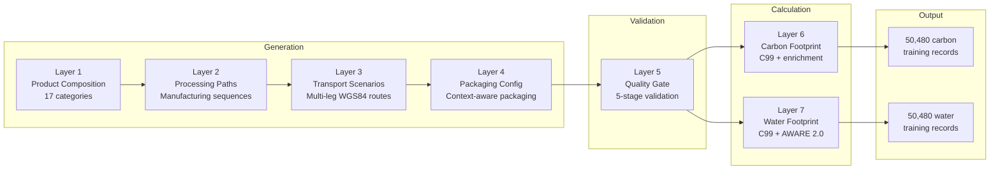
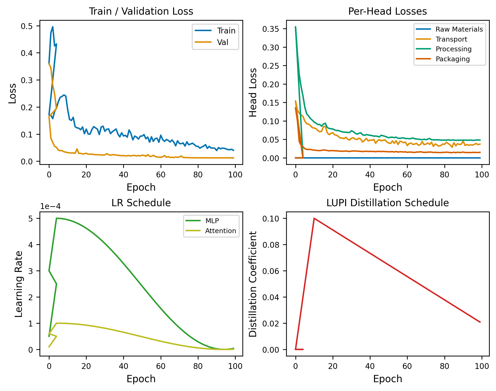
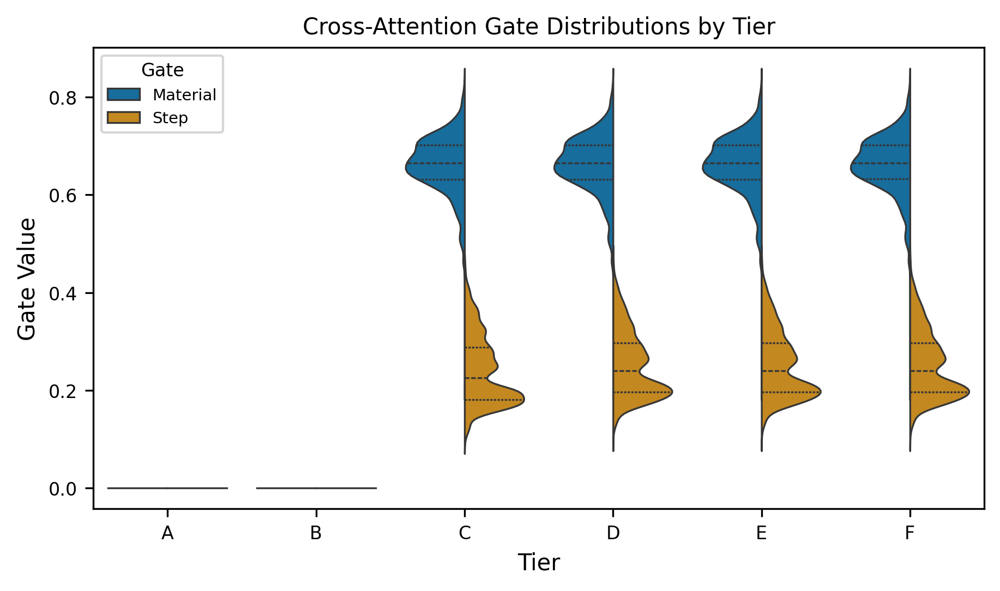
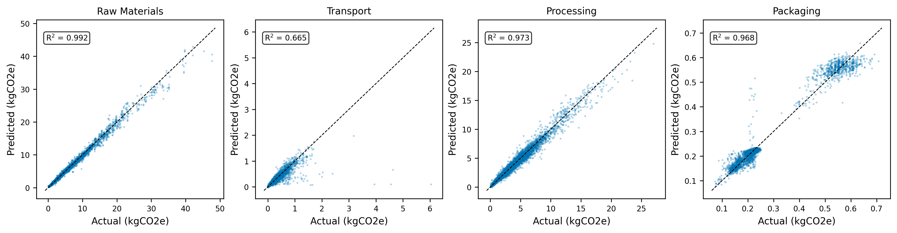
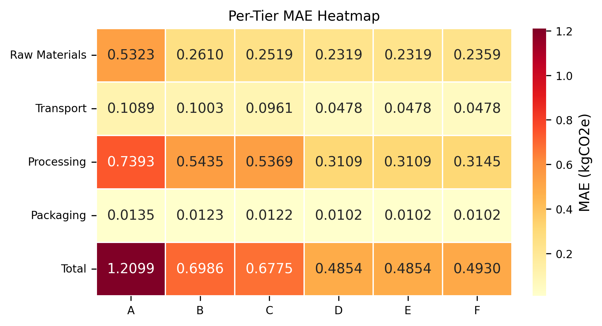
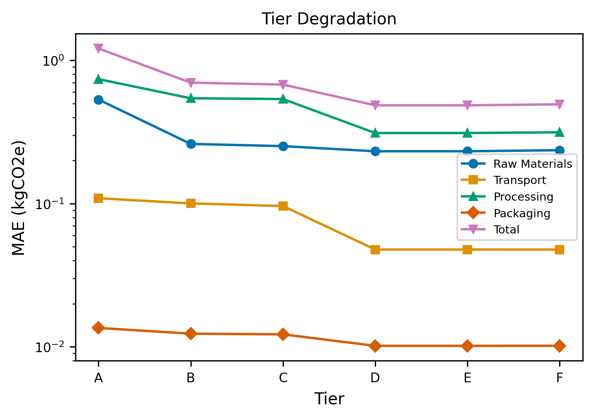
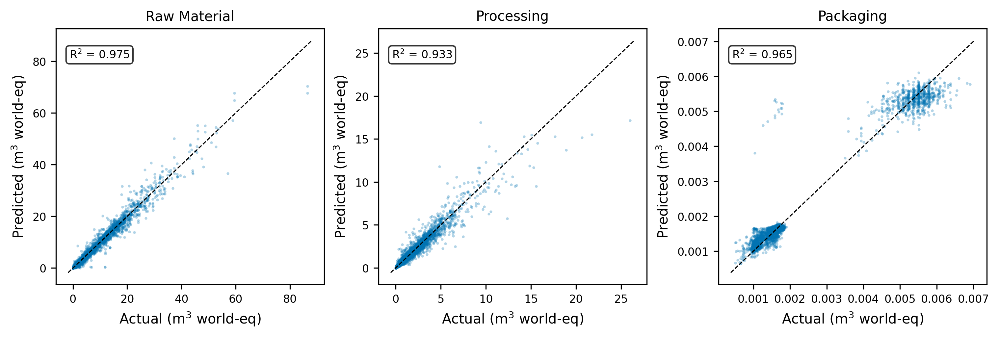
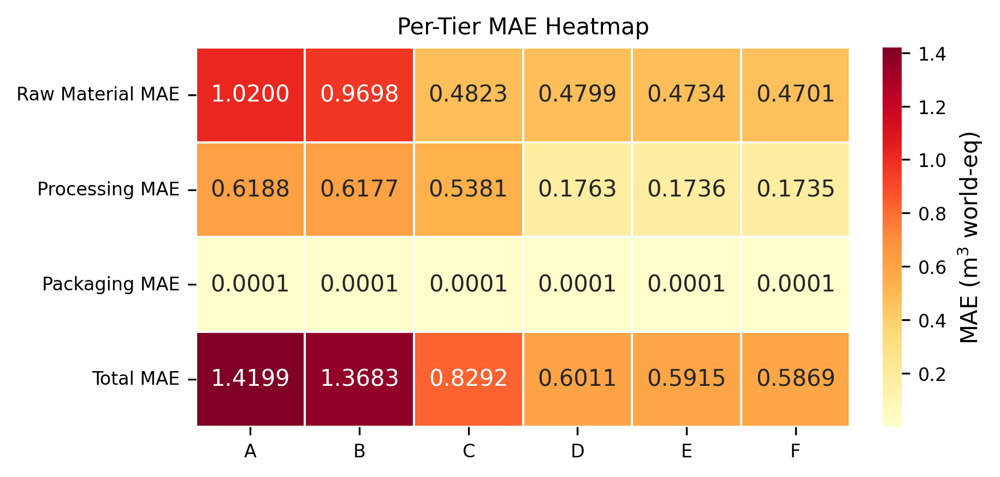
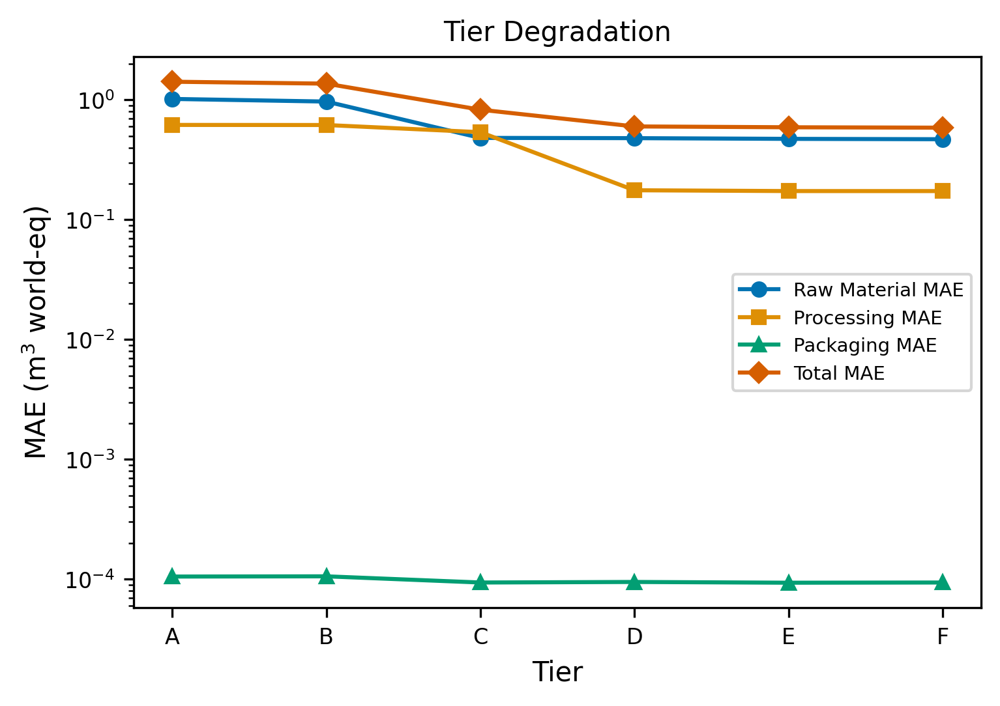

<div align="center">
  <h1>ESPResso V2</h1>
  <p><strong>LLM-orchestrated synthetic data pipeline and neural estimation of product-level carbon and water footprints in textiles</strong></p>
  <p>
    <a href="https://www.uva.nl"></a>
    <a href="#getting-started"></a>
    <a href="data/data-creation/calculation"></a>
    <a href="#carbon-footprint-model"></a>
    <a href="#data-pipeline"></a>
    <a href="#technical-methodology"></a>
    <a href="#technical-methodology"></a>
  </p>
  <p>
    <a href="#data-sources"></a>
    <a href="#data-sources"></a>
    <a href="#results-carbon-footprint"></a>
    <a href="#results-water-footprint"></a>
  </p>
</div>

---

## About

The textile industry faces mounting regulatory pressure to quantify and disclose product-level environmental footprints under the EU's Ecodesign for Sustainable Products Regulation (ESPR) and the Digital Product Passport (DPP) mandate. Comprehensive Life Cycle Assessment (LCA) data remains prohibitively expensive to collect at scale, and existing databases cover only a fraction of real-world product configurations.

ESPResso V2 addresses this gap with two contributions: a **7-layer LLM-orchestrated synthetic data pipeline** that generates 50,480 physically validated training records spanning material composition, manufacturing processes, supply chain geography, and packaging; and **two neural prediction models** -- one for carbon footprint (R^2 = 0.988) and one for water footprint (R^2 = 0.969) -- that estimate product-level environmental impact from variable-availability supply chain data.

Both models implement **tier-based masking** to handle the real-world reality that supply chain transparency varies dramatically across products. A fast-fashion retailer might know only the product category and material composition (Tier A); a vertically integrated manufacturer might have full traceability including transport routes and processing locations (Tier F). The models degrade gracefully across all six tiers.

## Table of Contents

**Methodology:**
- [About](#about) -- Regulatory motivation, project scope
- [Key Contributions](#key-contributions) -- What is new in V2
- [Methodology Evolution: V1 to V2](#methodology-evolution-v1-to-v2) -- How improved data enables direct calculation
- [Technical Methodology](#technical-methodology) -- Carbon and water footprint formulations

**Data Pipeline:**
- [Data Pipeline](#data-pipeline) -- 7-layer architecture overview
- [Pipeline Layers in Detail](#pipeline-layers-in-detail) -- Per-layer specifications

**Models:**
- [Carbon Footprint Model](#carbon-footprint-model) -- LUPI-enhanced multi-encoder architecture
- [Water Footprint Model](#water-footprint-model) -- Cross-attention geo-aware architecture

**Results:**
- [Results: Carbon Footprint](#results-carbon-footprint) -- Predictions, per-component metrics, tier analysis
- [Results: Water Footprint](#results-water-footprint) -- Predictions, per-component metrics, tier analysis
- [Comparison](#comparison) -- Carbon vs water model performance

**Reference:**
- [Repository Structure](#repository-structure) -- Directory layout
- [Getting Started](#getting-started) -- Prerequisites, installation, execution
- [Data Sources](#data-sources) -- EcoInvent, Agribalyse, AWARE
- [Contact](#contact) -- Maintainer information
- [Acknowledgments](#acknowledgments) -- Frameworks, standards, tools

## Key Contributions

1. **7-Layer LLM-Orchestrated Synthetic Data Pipeline** -- Claude Sonnet 4.6 drives layers 1-4, Claude Sonnet 4.5 handles validation (layer 5), and C99 deterministic engines compute both carbon (layer 6) and water (layer 7) footprints. The pipeline generates 50,480 validated records across 17 product categories, each containing full supply chain specifications with WGS84 coordinates, per-leg transport routes, and explicit manufacturing sequences.

2. **Dual Neural Prediction Models** -- Separate architectures for carbon and water footprints, each designed around the distinct physics of its domain. The carbon model uses LUPI (Learning Using Privileged Information) distillation for transport estimation; the water model uses cross-attention with confidence gates for geography-driven AWARE factor integration.

3. **Tier-Based Graceful Degradation** -- Six data availability tiers (A through F) model real-world supply chain transparency. Both models train with curriculum learning and stochastic tier masking, achieving only 2.4x MAE degradation from full traceability (Tier F) to minimal information (Tier A).

4. **Deterministic Calculation + Neural Estimation** -- The pipeline enforces a clean separation: LLMs generate realistic product configurations, C99 engines compute ground-truth footprints from established emission factor databases (EcoInvent 3.12, Agribalyse 3.2, AWARE 2.0), and neural networks learn to predict those footprints from partial information.

5. **Pipeline Resilience** -- When the UvA API gateway went down during Layer 6 enrichment, Gemini CLI (Gemini 3.1 Pro) was used as a direct fallback, demonstrating that the pipeline architecture tolerates provider failures without data loss.

## Methodology Evolution: V1 to V2

ESPResso V1 used LightGBM with three model variants and a meta-learner. Its synthetic data was not detailed enough to represent individual transport legs or specific manufacturing sequences, so V1 relied on probabilistic proxies and conservative enumeration.

### Transport: From Probabilistic to Direct

**V1 -- Multinomial logit transport mode estimation.** Because V1's synthetic data lacked per-leg route information, transport mode shares were probabilistically estimated from total distance using a multinomial logit model:

$$P_m(D) = \frac{\exp(U_m(D))}{\sum_k \exp(U_k(D))}$$

$$U_m(D) = \beta_{0m} + \beta_{1m} \cdot \ln(D)$$

$$EF_{\text{weighted}}(D) = \sum_m P_m(D) \cdot EF_m$$

$$CF_{\text{transport}} = \frac{w}{1000} \cdot D \cdot \frac{EF_{\text{weighted}}(D)}{1000}$$

where $P_m(D)$ is the probability of transport mode $m$ at distance $D$, $\beta$ coefficients were calibrated from industry logistics data, and the weighted emission factor averaged over all possible modes.

**V2 -- Direct per-leg calculation.** V2's pipeline generates actual multi-leg routes with WGS84 coordinates and explicit mode choices per leg. No probabilistic estimation is needed:

$$CF_{\text{transport}} = \sum_{l=1}^{L} d_l \cdot m \cdot EF_{\text{mode}(l)}$$

where each leg $l$ has an explicit distance $d_l$, mass $m$, and mode-specific emission factor $EF_{\text{mode}(l)}$.

### Processing: From Enumeration to Specific Sequences

**V1** conservatively enumerated all applicable processing steps for each material type. **V2** uses LLM-generated specific manufacturing sequences -- a cotton jersey t-shirt gets spinning, knitting, scouring, dyeing, finishing; not every possible cotton processing step.

### Model Architecture: From Trees to Neural Networks

**V1** used LightGBM ensembles, which work well for tabular data but cannot natively handle variable-length structured inputs. **V2** uses PyTorch neural networks with set-based encoders, attention mechanisms, and per-component output heads -- naturally handling variable numbers of materials, transport legs, and processing steps.

### Scope: From Carbon-Only to Carbon + Water

**V1** estimated carbon footprint only. **V2** adds water footprint estimation with a dedicated architecture that accounts for the fundamentally different physics: water impact varies by 40-100x across manufacturing locations due to local water stress (AWARE factors), whereas carbon emissions vary by only 2-3x geographically.

## Technical Methodology

### Carbon Footprint Formulation

The total carbon footprint for a product record is computed deterministically from four LCA-phase components:

$$CF_{\text{total}} = \left( CF_{\text{raw}} + CF_{\text{processing}} + CF_{\text{transport}} + CF_{\text{packaging}} \right) \times 1.02$$

where the 1.02 multiplier accounts for model calibration overhead. Each component is defined as:

$$CF_{\text{raw}} = \sum_{i} w_i \cdot EF_i$$

where $w_i$ is the mass of material $i$ in kg and $EF_i$ is the corresponding emission factor in kgCO2e/kg.

$$CF_{\text{processing}} = \sum_{s} EF_{\text{step}(s)} \cdot w_{\text{material}(s)}$$

where $EF_{\text{step}(s)}$ is the energy intensity of processing step $s$ and $w_{\text{material}(s)}$ is the mass of the material being processed.

$$CF_{\text{transport}} = \sum_{l=1}^{L} d_l \cdot m \cdot EF_{\text{mode}(l)}$$

where $d_l$ is the distance of transport leg $l$ in km, $m$ is the total product mass in tonnes, and $EF_{\text{mode}(l)}$ is the mode-specific emission factor in gCO2e/tkm.

$$CF_{\text{packaging}} = \sum_{p} w_p \cdot EF_p$$

where $w_p$ is the mass of packaging material $p$ and $EF_p$ is its emission factor.

### Water Footprint Formulation

Water footprint calculation follows AWARE 2.0 methodology, where location-specific water stress characterization factors amplify the volumetric water consumption:

$$WF_{\text{raw}} = \sum_{i} w_i \cdot WU_i \cdot CF_{\text{AWARE}}(c_i)$$

where $WU_i$ is the water use intensity of material $i$ (m^3/kg) and $CF_{\text{AWARE}}(c_i)$ is the AWARE characterization factor for country $c_i$.

$$WF_{\text{processing}} = \sum_{s} WU_{\text{step}(s)} \cdot w_{\text{material}(s)} \cdot CF_{\text{AWARE}}(c_s)$$

$$WF_{\text{packaging}} = \sum_{p} w_p \cdot WU_p \cdot CF_{\text{AWARE}}(c_p)$$

The AWARE factors range from 0.1 (water-abundant regions) to 100 (severely water-stressed regions), creating the 40-100x geographic variance that the water model must capture.

## Data Pipeline



| Layer | Purpose | Model | Language | Key Detail |
|-------|---------|-------|----------|------------|
| 1 | Material composition | Claude Sonnet 4.6 | Python | 17 categories, 87 materials, percentages summing to 100% |
| 2 | Manufacturing sequences | Claude Sonnet 4.6 | Python | 1,200+ valid material-process combinations |
| 3 | Supply chain geography | Claude Sonnet 4.6 | Python | WGS84 coordinates, per-leg distances, 5 transport modes |
| 4 | Packaging configuration | Claude Sonnet 4.6 | Python | Context-aware: product weight, fragility, distance |
| 5 | Multi-stage validation | Claude Sonnet 4.5 | Python | 5-stage gate: MD5, semantic coherence, statistics, sampling, decision |
| 6 | Carbon footprint calc | C99 deterministic | C99 | Enrichment via Claude CLI (Sonnet 4.6) + Gemini CLI (Gemini 3.1 Pro) fallback |
| 7 | Water footprint calc | C99 deterministic | C99 | AWARE 2.0 factors, EcoInvent 3.12, Agribalyse 3.2 |

## Pipeline Layers in Detail

### Layer 1: Product Composition Generator

Generates realistic material compositions for 17 product categories with 87 base materials. Each record specifies materials, mass fractions, and total product weight. The LLM selects materials contextually -- a down coat receives polyester shell and duck down fill; a cotton t-shirt receives jersey knit cotton with elastane blend.

**Key constraint:** Material percentages must sum to exactly 100% per product.

### Layer 2: Processing Path Generator

Enumerates valid manufacturing sequences from a reference table of 1,200+ material-process combinations. Each Layer 1 product expands to records representing distinct feasible manufacturing pathways.

### Layer 3: Transport Scenario Generator

Generates geographically realistic supply chain routes with WGS84 coordinates, per-leg transport distances, and modal choices (road, sea, rail, air, inland waterway). Each record includes full narrative reasoning for route decisions. Five distance variants per input record.

### Layer 4: Packaging Configuration Generator

Produces context-aware packaging specifications based on product weight, fragility indicators, and transport distance. Two packaging variants per record, each specifying packaging materials and masses.

### Layer 5: Validation Layer

The quality gate. Implements a 5-stage validation pipeline:

| Stage | Method | Criteria |
|-------|--------|----------|
| 1. Passport Verification | MD5 hash comparison | Upstream data integrity preserved |
| 2. Semantic Coherence | LLM batch evaluation (50 records) | 5-dimension score >= 0.85 |
| 3. Statistical Quality | 3-sigma outlier detection, dedup | No duplicates, no extreme outliers |
| 4. Reward Scoring | 3% sample LLM evaluation | Quality score >= 0.60 |
| 5. Final Decision | Aggregate classification | Accept / Review / Reject |

**Result:** 50,480 accepted records from the initial candidate pool.

### Layer 6: Carbon Footprint Calculation

Deterministic C99 engine computing carbon footprints. Reads validated records, applies emission factor lookups for each LCA phase, and outputs the final training dataset with carbon footprint fields per component. No LLM involvement in the core calculation -- pure arithmetic over established emission factors.

**Enrichment story:** During Layer 6, some records required additional context (material emission factor mappings, processing energy intensities). The primary enrichment path used Claude CLI running Sonnet 4.6 via the UvA API gateway. When the gateway experienced downtime, enrichment transparently switched to Gemini CLI running Gemini 3.1 Pro as a direct fallback, demonstrating the pipeline's resilience to provider failures.

### Layer 7: Water Footprint Calculation

Deterministic C99 engine computing water footprints using AWARE 2.0 characterization factors, EcoInvent 3.12 water use intensities, and Agribalyse 3.2 agricultural water data. Processes the same validated records as Layer 6, producing parallel water footprint fields per component.

## Carbon Footprint Model

**LUPI-Enhanced Multi-Encoder with Dual CLS** -- 546K parameters, 4 output heads (raw materials, transport, processing, packaging).

The carbon model addresses a fundamental inference challenge: at prediction time, detailed transport information (per-leg distances, modes) is unavailable for most products. The model uses Learning Using Privileged Information (LUPI) to distill transport knowledge from a privileged encoder (available during training) into a proxy encoder (available at inference).

### Architecture

```
Input Features
    |
    +-- MaterialEncoder ---------> mat_emb [B, 96]
    |     emb(48) + pct -> MLP(96) + 2-head self-attn + LN
    |
    +-- StepLocProxy ------------> proxy_t [B, 96], proxy_p [B, 96]
    |     step_emb(32) + coords(32) -> MLP(96)
    |     dual CLS tokens + 4-head self-attn
    |     gated geo fusion (27 features -> sigmoid gate)
    |
    +-- ProductEncoder ----------> product_emb [B, 64]
    |     cat_emb(24) + subcat_emb(24) + weight + zscore + coverage + flags
    |
    +-- TransportEncoder --------> transport_emb [B, 96]  (TRAINING ONLY)
    |     6 log-distances -> MLP(96)
    |
    +-- MaterialLocAssignment ---> mat_loc_feature [B, 32]
          cross-attn(48) + Sinkhorn(3 iters) -> MLP(32)
    |
    v
Residual Trunk (192-dim, 3 blocks, LN + Linear + GELU + Dropout)
    |
    +-- head_raw_materials -----> pred [B, 1]
    +-- head_transport ---------> pred [B, 1]  (trunk + mat_loc_feature)
    +-- head_processing --------> pred [B, 1]  (+ gradient-isolated branch)
    +-- head_packaging ---------> pred [B, 1]  (+ direct shortcut bypass)
```

### Key Components

**Dual CLS Tokens.** The StepLocProxy prepends two learned CLS tokens to the step-location sequence before self-attention. CLS_transport is distilled toward the privileged TransportEncoder output; CLS_processing is free, trained only by the processing head's task loss. This prevents transport optimization from corrupting processing-relevant attention patterns.

**Multi-Scale Coordinate Encoding.** Geographic coordinates are encoded as 32-dimensional multi-scale sinusoidal features across 8 frequency scales, capturing both continental-scale and city-level spatial patterns.

**Gated Geo Fusion.** 27 geographic features (3 haversine statistics + 16-bin pairwise distance histogram + 8 top-K step-pair distances) pass through a learned sigmoid gate controlling per-dimension mixing with the CLS attention output. This prevents the projection MLP from routing everything through scalar statistics and ignoring the attention mechanism.

**MaterialLocAssignment.** Cross-attention with Sinkhorn normalization (3 iterations) solves the bipartite assignment problem: materials and locations are specified separately (not which material is processed where). The module learns soft doubly-stochastic assignments, producing a 32-dim transport-relevant feature for the transport head.

**LUPI Distillation Schedule.** The privileged TransportEncoder sees ground-truth per-leg distances during training. A composite distillation loss (RKD with `rkd_alpha=0.5` blending instance MSE and pairwise distance preservation) transfers this knowledge to the proxy. The distillation coefficient warms up over 10 epochs, peaks at 0.10, then decays linearly to a floor of 0.02.

**Packaging Shortcut.** A direct bypass of the trunk that predicts packaging footprint from packaging mass, category, and subcategory embeddings. The trunk head and shortcut predictions are summed, allowing the shortcut to handle the dominant signal (packaging mass) while the trunk captures subtle product-type interactions.

**Gradient-Isolated Processing Branch.** A separate MLP predicts processing footprint from StepLocProxy output (detached) and product embedding. Its output is added to the trunk's processing prediction as a correction term, providing an independent gradient path.

### Loss Function

Three-group hierarchical loss:

| Group | Components | Weighting |
|-------|-----------|-----------|
| **Main task** | 4 per-component losses (MSE for raw/processing, log-cosh for transport/packaging) | Analytical UW-SO with DB-MTL log-normalization, min 10% floor per head |
| **Auxiliary** | Distance prediction, mode fraction, weight prediction | Linear warmup over curriculum, `aux_alpha=0.1` |
| **Structural** | RKD distillation, proxy diversity (cosine), attention entropy regularization | Warmup-then-decay schedule, `entropy_alpha=0.01` |

### Training Configuration

| Parameter | Value |
|-----------|-------|
| Optimizer | AdamW (differential LR: 0.2x for attention, 1x for MLP) |
| Learning rate | 5e-4 base, cosine schedule |
| Batch size | 1024 |
| Weight decay | 0.01 (MLP), 0.005 (attention), 0.0 (embeddings) |
| Curriculum warmup | 30 epochs |
| Tier distribution | A:10%, B:15%, C:20%, D:20%, E:20%, F:15% |
| LUPI priv_ratio | 0.60 (trunk sees privileged transport 60% of training) |
| Target transform | log1p + z-score normalization |
| Epochs run | 105 |

<p align="center">
  
</p>

## Water Footprint Model

**Cross-Attention Geo-Aware Network** -- 469K parameters, 3 output heads (raw materials, processing, packaging).

The water model addresses a fundamentally different challenge than the carbon model: geographic location is the dominant factor, not just a minor contributor. The AWARE characterization factor for water stress can vary by 40-100x between countries for the same material and process, compared to only 2-3x variation in carbon emissions. This makes geography the primary signal, requiring an architecture that deeply integrates location information.

### Architecture

```
Input Features
    |
    +-- MaterialEncoder ---------> mat_emb [B, 5, 64]
    |     emb(32) + log_weight + pct -> MLP(64) + 2-head self-attn + LN
    |
    +-- StepEncoder -------------> step_emb [B, 27, 64]
    |     emb(24) + sinusoidal position(4) -> MLP(64)
    |
    +-- LocationEncoder ---------> loc_emb [B, 8, 64]
    |     emb(32) + sincos coords(4) -> MLP(64)
    |
    +-- ProductEncoder ----------> product_emb [B, 48]
    |     cat_emb(16) + subcat_emb(16) + log_weight + 5 mask flags
    |
    +-- PackagingEncoder --------> pkg_emb [B, 32]
          3 log_masses + 3 category embeddings(16 each) -> MLP(32)
    |
    v
GeoAttentionBlock (materials x locations)
    2 layers, 4 heads, d_model=64
    + ConfidenceGate (MLP, bias_init=-2.0)
    |
GeoAttentionBlock (steps x locations)
    2 layers, 4 heads, d_model=64
    + ConfidenceGate (MLP, bias_init=-2.0)
    |
    v
Mean Pool -> Concatenate [mat(64) + step(64) + product(48) + pkg(32) = 208]
    |
Residual Trunk (128-dim, 2 blocks, LN + Linear + GELU + Dropout)
    |
    +-- head_raw_materials -----> pred [B, 1]  (MLP 128->64->1)
    +-- head_processing --------> pred [B, 1]  (MLP 128->64->1)
    +-- head_packaging ---------> pred [B, 1]  (MLP 128->64->1)
```

### Key Components

**GeoAttentionBlock.** Two stacked cross-attention layers (4 heads each) where materials (or steps) attend to location keys. Residual connections and LayerNorm after each layer. The same location encoder output serves as both keys and values for material-geo and step-geo blocks, creating a shared geographic representation.

**Confidence Gate.** An MLP gate (`d_model+1 -> hidden(16) -> sigmoid`) that blends the cross-attention output with a learned prior embedding. The gate bias is initialized to -2.0, starting at approximately 0.12 (prior-heavy). When geographic information is available and the attention match quality is high, the gate opens; when locations are masked or attention is uncertain, the model falls back to the prior. This is critical because geography drives 40-100x variance in water footprint.

**Linked Journey Mode.** During training, 50% of batches use "linked" location representations (origin-to-processing journey order), while 50% use unlinked location sets. This teaches the model to handle both sequential supply chain routes and unordered location inventories.

**Auxiliary Weight Prediction.** A dedicated head predicts product weight from category embedding and material features only (no access to actual weight). This auxiliary task (`alpha=0.3`) regularizes material and category representations, improving robustness when weight is unavailable at lower tiers.

<p align="center">
  
</p>

### Loss Function

UW-SO (Uncertainty-Weighted Softmax) with learnable log-variance scalars:

| Head | Loss Type | Description |
|------|-----------|-------------|
| Raw materials | MSE | Dominant component, benefits from standard regression loss |
| Processing | MSE | Second-largest component |
| Packaging | Huber (delta=1.5) | Near-constant values; Huber prevents outlier-driven instability |
| Auxiliary weight | MSE | Weighted by `aux_alpha=0.3`, only on weight-available samples |

Log-variance scalars are clamped to [-4, 4] to prevent the regularization term from driving total loss negative while still allowing approximately 50x weight variation between heads.

### Training Configuration

| Parameter | Value |
|-----------|-------|
| Optimizer | AdamW |
| Learning rate | 5e-4, cosine schedule |
| Batch size | 1024 |
| Weight decay | 0.01 |
| Curriculum warmup | 20 epochs |
| Tier distribution | A:35%, B:25%, C:15%, D:10%, E:10%, F:5% |
| Subcategory mask | 15% independent dropout |
| Target transform | log1p + z-score normalization |
| Epochs run | 105 |

Note the water model's tier distribution is heavily skewed toward degraded tiers (A+B = 60%) compared to the carbon model (A+B = 25%). This reflects the water model's design priority: geography is so dominant that the model must excel at graceful degradation when location data is unavailable.

## Results: Carbon Footprint

<p align="center">
  
</p>

### Per-Component Test Set Metrics

| Component | MAE | R^2 | SMAPE |
|-----------|-----|-----|-------|
| Raw materials | 0.229 kgCO2e | 0.992 | 6.2% |
| Processing | 0.307 kgCO2e | 0.971 | 9.7% |
| Transport | 0.048 kgCO2e | 0.691 | 18.6% |
| Packaging | 0.010 kgCO2e | 0.964 | 4.2% |
| **Total** | **0.479 kgCO2e** | **0.988** | **6.3%** |

Transport is the weakest head (R^2 = 0.691) -- expected, because the proxy must infer transport distances from indirect geographic signals without access to actual per-leg route data at inference time. The LUPI distillation provides a substantial improvement over a naive proxy (which would be near-random), but transport remains inherently harder to estimate than material-driven components.

### Tier Degradation

<p align="center">
  
</p>

<p align="center">
  
</p>

Overall tier degradation factor: 2.4x (Tier A MAE / Tier F MAE). The degradation is concentrated in transport and processing heads, where geographic and manufacturing sequence information provides the most discriminative signal. Raw materials and packaging heads are relatively tier-invariant because their primary drivers (material composition, packaging mass) are available from Tier B onward.

## Results: Water Footprint

<p align="center">
  
</p>

### Per-Component Test Set Metrics

| Component | MAE | R^2 | MAPE |
|-----------|-----|-----|------|
| Raw materials | 0.470 m^3 world-eq | 0.970 | 39.3% |
| Processing | 0.174 m^3 world-eq | 0.946 | 21.6% |
| Packaging | 0.0001 m^3 world-eq | 0.962 | -- |
| **Total** | **0.587 m^3 world-eq** | **0.969** | **15.8%** |

The raw materials MAPE (39.3%) is notably higher than the carbon model's equivalent (6.4%). This reflects the multiplicative effect of AWARE factors on water footprint: small errors in geographic attribution are amplified by 40-100x characterization factor ranges. The R^2 remains high (0.970) because the model captures the dominant patterns even when individual predictions have larger relative errors.

### Tier Degradation

<p align="center">
  
</p>

<p align="center">
  
</p>

Overall tier degradation factor: 2.4x. The confidence gates play a critical role here -- when location data is unavailable (Tiers A-B), the gates close (approaching 0.12) and the model relies on learned prior embeddings rather than noisy cross-attention output. This prevents catastrophic failure at low tiers despite geography being the dominant signal.

## Comparison

| Dimension | Carbon Footprint Model | Water Footprint Model |
|-----------|----------------------|---------------------|
| Architecture | LUPI Multi-Encoder + Dual CLS | Cross-Attention Geo-Aware |
| Parameters | ~546K | ~469K |
| Output heads | 4 (raw, transport, processing, packaging) | 3 (raw, processing, packaging) |
| Total R^2 | 0.988 | 0.969 |
| Total MAE | 0.479 kgCO2e | 0.587 m^3 world-eq |
| Geographic sensitivity | Low (2-3x variance) | High (40-100x variance via AWARE) |
| Key mechanism | LUPI distillation for transport proxy | Confidence-gated cross-attention for geography |
| Trunk dimension | 192, 3 residual blocks | 128, 2 residual blocks |
| Special modules | MaterialLocAssignment (Sinkhorn), TransportEncoder | GeoAttentionBlock, ConfidenceGate |
| Tier A-B strategy | Learned missing embeddings, packaging shortcut | Prior-heavy gates (bias -2.0), auxiliary weight |
| Tier distribution | A:10%, B:15%, C:20%, D:20%, E:20%, F:15% | A:35%, B:25%, C:15%, D:10%, E:10%, F:5% |
| Dataset | 49,732 records (70/15/15 split) | 49,732 records (70/15/15 split) |

## Repository Structure

<details>
<summary>Directory layout (click to expand)</summary>

```
ESPResso-V2/
+-- data/
|   +-- data-creation/                  # 7-layer synthetic data pipeline
|   |   +-- calculation/
|   |   |   +-- carbon_footprint/       # Layer 6: C99 carbon calculation engine
|   |   |   |   +-- include/            # Headers (transport, processing, packaging, etc.)
|   |   |   |   +-- src/               # C source files
|   |   |   |   +-- Makefile
|   |   |   +-- water_footprint/       # Layer 7: C99 water calculation engine
|   |   |       +-- include/            # Headers (AWARE, processing, packaging, etc.)
|   |   |       +-- src/               # C source files
|   |   |       +-- Makefile
|   |   +-- datasets/
|   |       +-- generated/              # Pipeline outputs per layer
|   |       |   +-- layer_4/
|   |       |   +-- layer_5/
|   |       |   +-- layer_6/
|   |       |   +-- layer_7/
|   |       +-- final/                  # Final training-ready datasets
|   |           +-- carbon_footprint/
|   |           +-- water_footprint/
+-- model/
|   +-- carbon_footprint/               # Carbon prediction model
|   |   +-- src/
|   |   |   +-- preprocessing/          # Dataset, transforms, parsing
|   |   |   +-- training/              # Model, encoders, loss, optimizer, trainer
|   |   |   +-- evaluation/            # Metrics, plots
|   |   |   +-- utils/                 # Config dataclass
|   |   +-- notebooks/                 # Colab manager notebook
|   +-- water_footprint/               # Water prediction model
|       +-- src/
|       |   +-- preprocessing/          # Dataset, transforms
|       |   +-- training/              # Model, encoders, cross-attention, loss, trainer
|       |   +-- evaluation/            # Metrics, plots
|       |   +-- utils/                 # Config dataclass
|       +-- notebooks/                 # Colab manager notebook
+-- results/
|   +-- carbon_footprint/
|   |   +-- runs.jsonl                  # Experiment log
|   |   +-- plots/                     # Training curves, predictions, tier analysis
|   +-- water_footprint/
|       +-- runs.jsonl                  # Experiment log
|       +-- plots/                     # Training curves, predictions, gate distributions
+-- UvA_llm_provider/                   # LLM API gateway submodule
+-- CLAUDE.md                           # Project rules and AI instructions
+-- README.md                           # This file
```

</details>

## Getting Started

### Prerequisites

- Python 3.10+
- GCC or Clang with C99 support
- PyTorch 2.0+ (with CUDA for GPU training)
- Google Colab account (for training; local CPU is supported for smoke tests)

### Installation

```bash
git clone https://github.com/tr4m0ryp/ESPResso-V2.git
cd ESPResso-V2
```

### Build the Calculation Engines

Carbon footprint (Layer 6):

```bash
cd data/data-creation/calculation/carbon_footprint
make clean && make all
```

Water footprint (Layer 7):

```bash
cd data/data-creation/calculation/water_footprint
make clean && make all
```

### Training

Both models are designed to run on Google Colab. Each approach has a `manager.ipynb` notebook that handles environment setup, data loading, training, and evaluation:

1. Open `model/carbon_footprint/notebooks/manager.ipynb` or `model/water_footprint/notebooks/manager.ipynb` in Colab.
2. Configure GitHub credentials in the initialization cell.
3. Run all cells -- the notebook handles LFS-skip cloning, dataset caching to Google Drive, smoke testing, viability checks, and full training.

For local smoke testing:

```bash
SMOKE_TEST=1 python -m model.carbon_footprint.src.training.trainer
SMOKE_TEST=1 python -m model.water_footprint.src.training.trainer
```

## Data Sources

**EcoInvent 3.12** -- Life cycle inventory database providing emission factors (kgCO2e/kg) for raw materials and processing steps, and water use intensities (m^3/kg) for industrial processes.

**Agribalyse 3.2** -- French agricultural LCA database providing water footprint data for natural fiber cultivation (cotton, wool, flax, hemp), complementing EcoInvent's industrial coverage.

**AWARE 2.0** -- Available WAter REmaining characterization factors by country, translating volumetric water consumption into water-stress-weighted m^3 world-equivalents. The factor ranges from 0.1 (Norway, abundant) to 100 (Saudi Arabia, severely stressed).

**Product Taxonomy** -- 17 top-level product categories (Outerwear, Knitwear, Denim, etc.) with subcategories, covering the primary segments of the fashion and apparel market.

**Base Materials Database** -- 87 textile-relevant materials with associated emission factors and water use intensities, spanning natural fibers (cotton, wool, silk), synthetics (polyester, nylon, acrylic), and specialty materials (down, leather, technical membranes).

**Processing Steps Reference** -- Manufacturing steps (spinning, weaving, dyeing, finishing, etc.) with 1,200+ validated material-process combinations defining which processing sequences are physically feasible for each material type.

## Contact

<p>
  <a href="https://github.com/tr4m0ryp"></a>
</p>

## Acknowledgments

- **ISO 14040/14044** -- Life Cycle Assessment framework governing the environmental footprint calculation methodology
- **PEFCR v3.1** -- Product Environmental Footprint Category Rules for apparel and footwear
- **EU Digital Product Passport (DPP)** -- Regulatory context motivating product-level environmental disclosure under the ESPR
- **AWARE 2.0** -- Water stress characterization methodology by WULCA (Water Use in LCA)
- **EcoInvent 3.12** -- Life cycle inventory database for emission factors and water use intensities
- **Agribalyse 3.2** -- Agricultural LCA database for natural fiber water footprints
- **Claude Sonnet 4.6 / 4.5 (Anthropic)** -- Primary LLM for data generation (Layers 1-4) and validation (Layer 5)
- **Gemini 3.1 Pro (Google)** -- Fallback LLM used during Layer 6 enrichment when the UvA API gateway was unavailable
- **[UvA AI Chat](https://aichat.uva.nl/)** -- University of Amsterdam AI platform providing LLM API access
- **PyTorch** -- Deep learning framework for both prediction models

### Key References

- Lambert, Sener & Savarese -- [Deep Learning under Privileged Information Using Heteroscedastic Dropout](https://arxiv.org/abs/1805.11614) (2018). Foundation for the LUPI distillation approach used in the carbon transport proxy.
- Momeni & Tatwawadi -- [Understanding LUPI](https://web.stanford.edu/~kedart/files/lupi.pdf) (Stanford). Overview of Learning Using Privileged Information frameworks.
- Wu et al. -- [Deep Multimodal Learning with Missing Modality: A Survey](https://arxiv.org/html/2409.07825v3) (2024). Survey informing the tier-based masking and missing-data architecture design.
- Fu, Dong, Wang & Tian -- [Weakly Privileged Learning with Knowledge Extraction](https://www.sciencedirect.com/science/article/abs/pii/S0031320324002681) (2024). Privileged information extraction methods applicable to the transport distillation pipeline.
- Zeng et al. -- [Estimating On-road Transportation Carbon Emissions from Open Data](https://arxiv.org/html/2402.05153v1) (2024). Geographic feature engineering for transport emission prediction.
- **Textile Exchange** -- [Supply Chain Taxonomy for the Textile, Apparel, and Fashion Industry](https://textileexchange.org/app/uploads/2024/12/Supply-Chain-Taxonomy.pdf) (2024). Reference taxonomy informing the product category structure.
- **Fashion for Good** -- [What is Textile Processing?](https://www.fashionforgood.com/our_news/what-is-textile-processing-understanding-the-fashion-supply-chain-and-its-environmental-impact/) Processing step definitions and environmental impact context.
